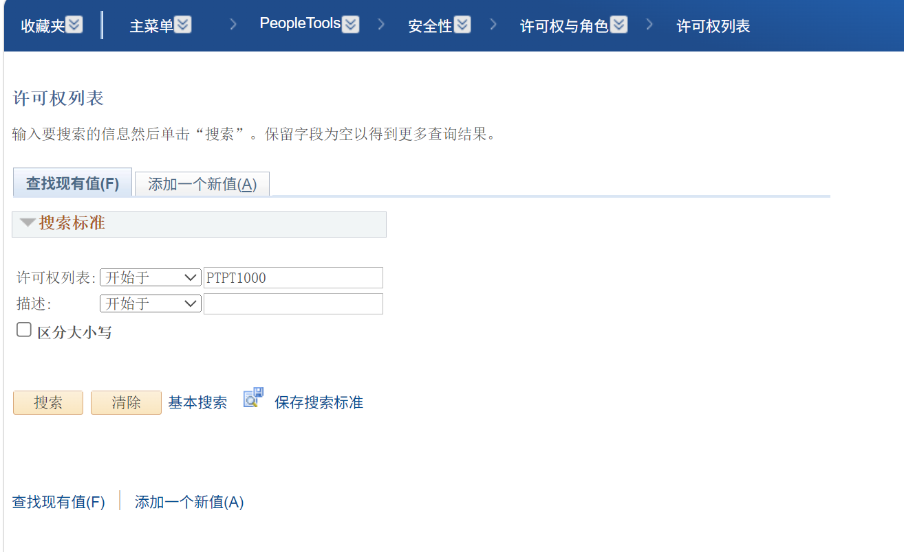
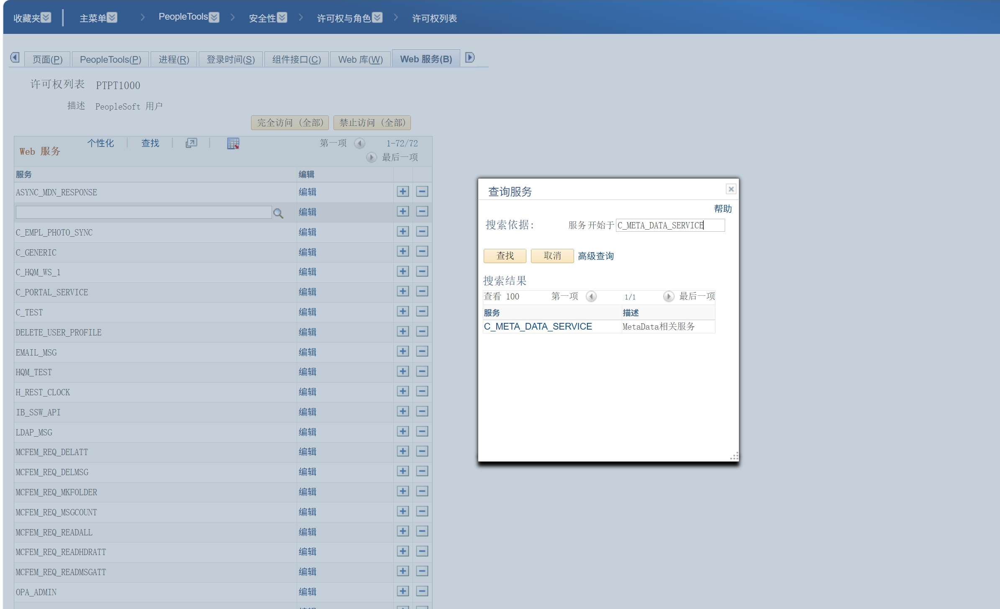
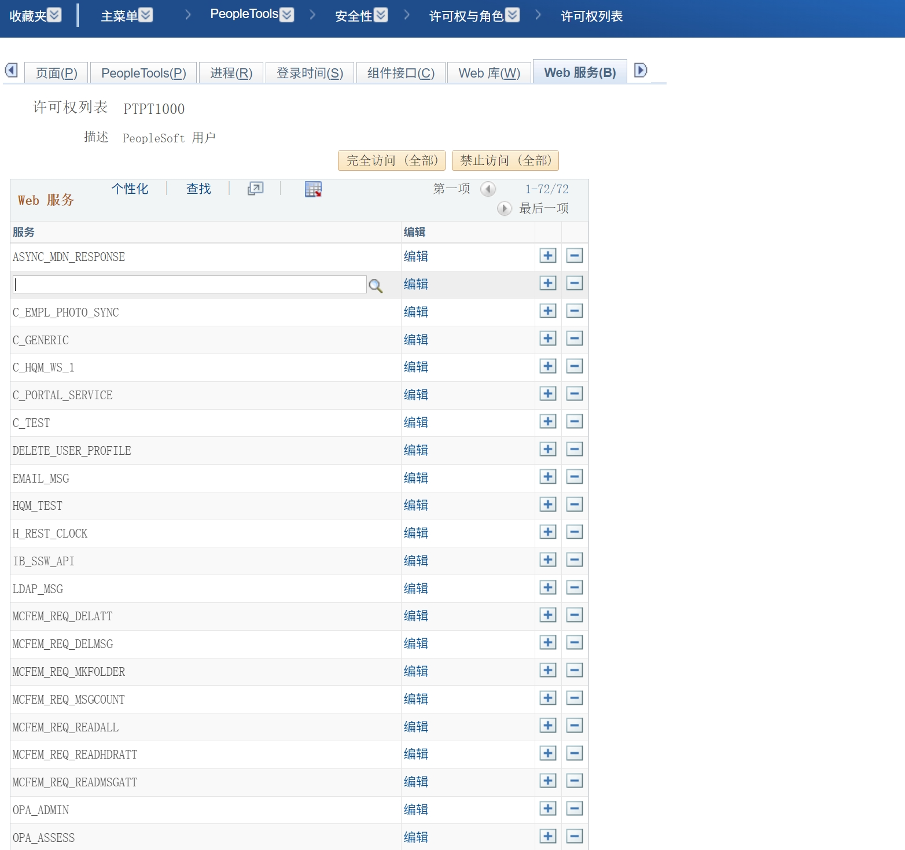
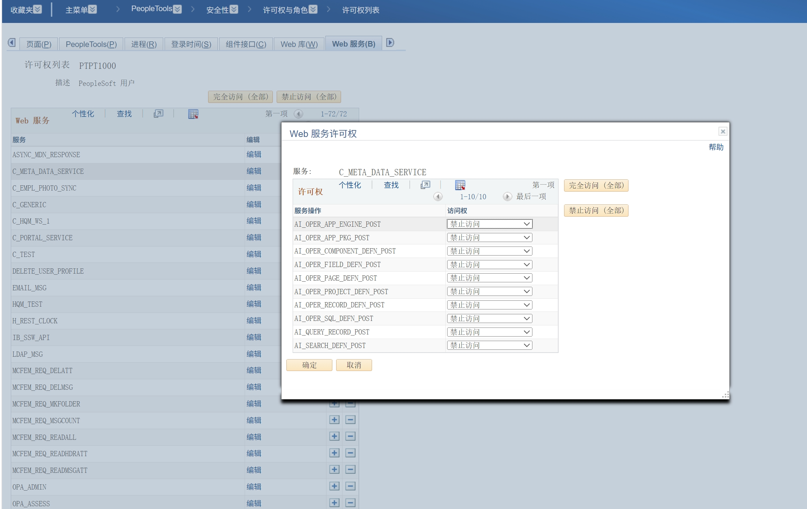
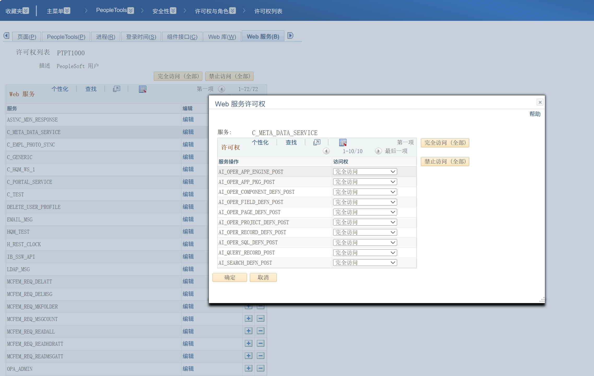
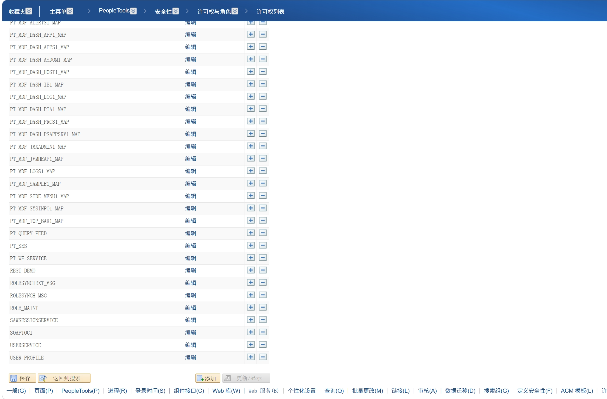

# REST 接口授权指南
遇到错误：用户 xxx 未经授权无法调用服务操作 应使用本文档完成接口授权

## 授权方式

有两种授权方式：
1.Agent自行授权(推荐)，Agent根据本文档后续内容完成授权,(需要Agent拥有操作浏览器的能力，curl无法完成)
2.用户手动授权，让用户根据本文档的内容完成(此时将本文档链接返回给用户)

## 授权目标

### 确定许可权列表

默认许可权：PTPT1000
Web服务权限是跟着系统的许可权确认的，本skill建议使用PTPT1000进行授权(需用户确认)，如果用户提出在其它许可权中进行授权以用户提供的许可权为准。

确认许可权列表后需授权的Web服务如下：

- `C_PORTAL_WEBSITE`
~~~text
PSTOKEN_GET
~~~

- `C_META_DATA_SERVICE` 
~~~text
AI_OPER_APP_ENGINE_POST
AI_OPER_APP_PKG_POST
AI_OPER_COMPONENT_DEFN_POST
AI_OPER_FIELD_DEFN_POST
AI_OPER_PAGE_DEFN_POST
AI_OPER_PROJECT_DEFN_POST
AI_OPER_RECORD_DEFN_POST
AI_OPER_SQL_DEFN_POST
AI_QUERY_RECORD_POST
AI_SEARCH_DEFN_POST
~~~

## 操作步骤

### 1. 打开权限列表

进入：

~~~text
> PeopleTools > 安全性 > 许可权与角色 > 许可权列表
~~~

在“查找现有值”中输入要修改的权限列表名称并搜索。下图是示例页面，实际权限列表名称以目标环境为准。

### 2. 打开 Web 服务权限

进入权限列表后，切换到 **Web 服务** 页签，先在服务列表中搜索：

~~~text
C_PORTAL_WEBSITE
~~~

打开该服务的编辑页面，确认 `PSTOKEN_GET` 的访问权为 **完全访问**。如果页面显示的是接口别名，则确认 `PSTOKEN.v1` 为 **完全访问**。

然后继续在服务列表中搜索元数据接口服务：

~~~text
C_META_DATA_SERVICE
~~~

可以在查询窗口中按“服务开始于”搜索：

确认结果中出现 `C_META_DATA_SERVICE` 后打开编辑：

### 3. 设置 Service Operation 访问权

在 `C_META_DATA_SERVICE` 的权限窗口中，将“授权”页签列出的上述 Service Operation 设置为 **完全访问**。

截图中的“禁止访问”表示尚未授权：

授权后应显示为“完全访问”：

不要只授权 `AI_SEARCH_DEFN_POST`：搜索、定义读取、PeopleCode 查看、Project 管理、Record 构建或业务数据查询分别使用不同的 Service Operation，应按实际任务授予对应操作。

### 4. 保存

如果权限列表页面有分页或弹窗滚动条，确认所有需要的操作都已设置后，滚动到窗口底部，点击 **保存**。

### 完整健康检查

完成保存后，以下命令是授权验证的标准入口，并替代上面的分散最小验证命令：

~~~powershell
python scripts\peoplesoft_api.py healthcheck --refresh
~~~

只有 PSTOKEN_GET 与全部十个元数据 Service Operation 均显示 PASS，才可报告安装和授权完成。Token 成功但任一元数据操作失败时，检查对应的 C_META_DATA_SERVICE 操作是否为完全访问；不要重新导入 Project 来替代授权修复。
